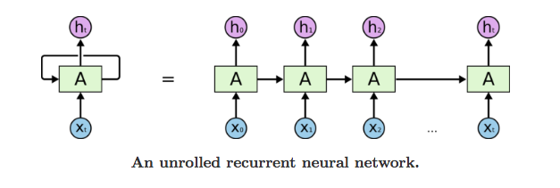
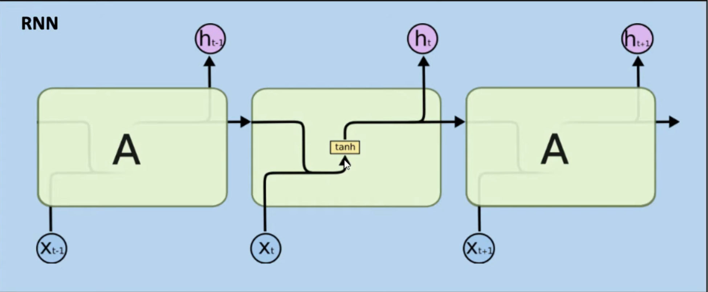
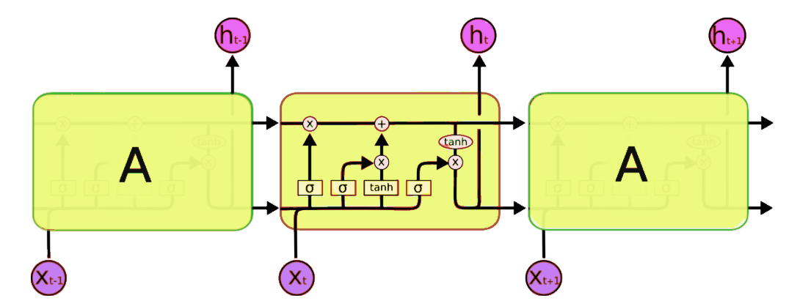
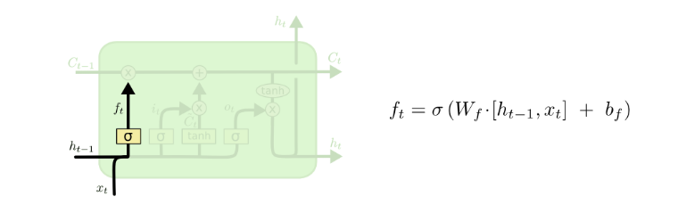
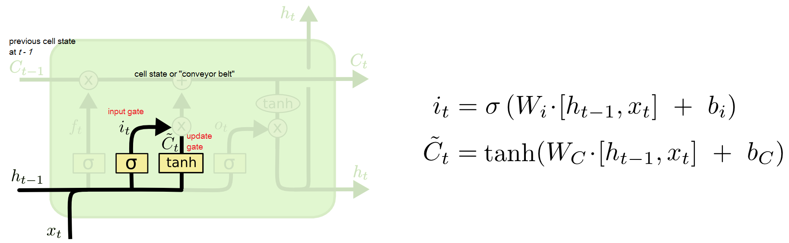

# **Recurrent Neural Networks (RNN) & Long-Short-Term Memory (LSTM)**

Source: [165 -An Introduction to RNN and LSTM](https://youtu.be/Mdp5pAKNNW4?si=lGIekH2AbpLY-uSE)

## **Difference b/w Recurrent Nueral Network & Traditional Deep Learning**
We will have an input image which is passed through a **Convolutional** which extracts features from the input and then pass it to **Max Pool** Layers which is then passed to **Fully Connected** Dense layers from which we get the output. And the output would be a probability of class.

The difference between the *Traditional Deep Learning Model* and *Recurrent Network* is that traditional DL is a feed forward network and in RNN the information is also back propagated, in simpler terms RNN remembers the past. 

Summary is that Recurrent Nueral Networks are different from normal Nueral Networks in the fact that they remember the past. RNNs have memory.

## **How do RNNs remember and Why do we need them?**
When we consider rembering the past and time series data, one of the important topic is **Autocorrelation**.  

### **Autocorrelation**
Autocorrelation measures the similarity between a time sereies and a lagged version of itself, essentially qualifying how a data point's current value is related to its past values at specific time intervals (lags). It's also known as serial correlation or serial dependence, and it indicates whether there's a predictable pattern within the data series itself. **Positive autocorrelation** means _high values follow high values_, while **negative  autocorrelation** means _high values are followed by low values._

#### **How it Works?**
* **Time Series Data**: Autocorrelation applies to data collected over time, such as daily temperatures or monthly sales figures.
* **Lagging**: A lagged version of the data means shifting the series by a certain number of time periods (e.g., comparing today's temperature with yesterday's which is a lag of 1).
* **Correlation**: You then calculate the standard correlation coefficient between the original series and its lagged version at various lags.
* **Patterns**: A high correlation at a specific lag suggests a pattern; for example, strong autocorrelation at lag 12 for monthly data might signal a yearly seasonal trend.

#### **Why it's important?**
* **Predictive Power**: Autocorrelation helps in predicting future values in a time series based on past behaviour.
* **Model Diagnostics**: The presence of autocorrelation in the residuals (errors) of a time series model can indicate that the model is not capturing the full temporal structure of the data, suggesting the model be "unsound".
* **Applications**: It's used in fields like econometrics, signal processing, demand forecasting, and even in GPS technology to improve accuracy.

#### **Types of Autocorrelation**
* **Positive Autocorrelation**: When high values are likely to be followed by high values, and low values by low values (e.g., a stock rally)
* **Negative Autocorrelation**: When high values tend to be followed  by low values and vice-versa (e.g., mean-reverting processes).

#### **Tools for Analysis**
* **Autocorrelation Function (ACF)**: A common tool used to calculate and visualize the correlation coefficients across different lags, helping to identify repeating patterns or seasonalities.

In time series data, we compare one column to itself and not other features, and that is called autocorrelation, for which we need **RNN** Simple example, I have a table with two columns 'Day' & 'Food'. What food I eat today depends on what food what I had in the past and not on what day it is. This shows that the data point is compaired to the same column and not to the other column, for that is that usual case of Normal Nueral Networks. 

## **Unrolling an RNN**
RNNs are "unrolled" programmatically during training and prediction. 
 
RNN is like multiple copies of the same network where each copy passes information to the other. The list like structure makes them appropriate for sequential data. (e.g. time series, natural langauge, etc.)

## **Types of RNN**
* **one to one**: Image classification ( regular nueral networking )
* **one to many**: Image captioning (explaining a scene, eg: "a cat infront of a car")
* **many to one**: Sentiment Analysis (bunch of tweets is passed as input and model outputs the sentiment)
* **many to many**: Language Translation ( English -> German )

## **Problem with RNN**
RNNs are good with short sequences such as: 
*The sky is _________ (Answer: Blue)*

But ....
*This is the 10th day of wildfires in the San Francisco bay area.*  
*There is smoke everywhere, it is snowing ash and the sky is_____.*  
*(Correct answer: Red)*

RNNs are not good at remembering the context of a sentence from a previous sentence. 

**LSTM is a special kind of RNN**  
LSTM - Long Short-Term Memory  
Designed to overcome limitations of RNNs such as:
* Gradient vanishing and exploding.
* Complex training.
* Difficulty to process very long sequences
Remembering information for long periods of time is intrinsic to LSTM. 

**Whats happening inside an RNN**  
  
An RNN has one **tanh** and the previous cell information is passed into the next cell.

## **Introducing LSTM**
  

Cell of an LSTM is much more complex than an RNN cell. It has 2 tanh and 3 sigmoid.  
Cell state : the information is passed through it to the next, state pf the cell.
To this cell state we are supplying all other values. One value is multiplied another value is added, as you can in the diagram.
The first thing inside the LSTM cell is the 
1. **forget gate** : in simple terms it controls what is let into the cell state. ( it helps us with what information to forget and what information to rememeber )
2. **input gate**: controls the amount of information passes into the cell state.
3. **output gate**: controls the amount of information passed to the next cell.

Information flows through the path, and Gates let information through the cell state. 
**Why Sigmoid?**  
Sigmoid can output 0 to 1, it can be used to forget or remember the information. 
* 0: Forget everything
* 1: Let everything from last cell through.

**Why tanh**  
To overcome the vanishing gradient problem. tanh's second derivative can sustain for a long range before going to zero. Also good for adding weight.

### **Forget gate** : How much of the past to forget.
  

**Forget gate formula:**  

<!--
$$ ft = (Wf.[ht-1, xt] + bf) $$
$$ x = {-b \pm \sqrt{b^2-4ac} \over 2a} $$
-->

Outputs a number between 0 and 1 for each number in the cell state. 0 to completely forget and 1 to keep all information.

### **Input gate**: What new information will be stored in the cell state.
  

$it$ : Sigmoid layer decides which values are updated.  
$Ct$ : tanh layer gives weights to the values to be added to the state. 